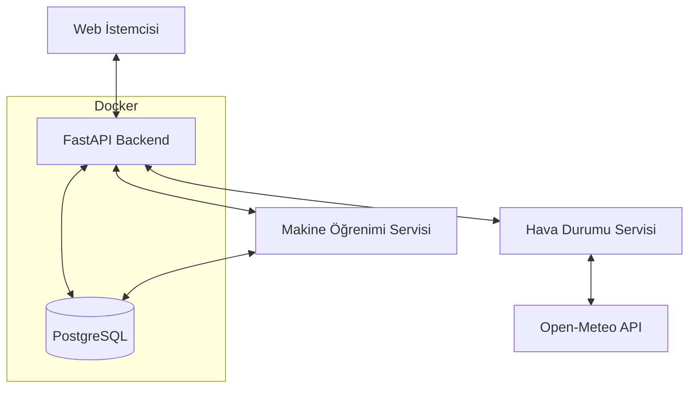
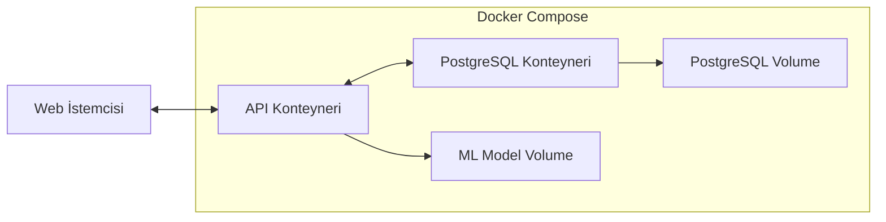

# Sistem Mimarisi ve Tasarım Desenleri

## Genel Mimari
Sistem, bir FastAPI backend ve PostgreSQL veritabanından oluşmaktadır. Makine öğrenimi modelleri, inverter'ların güç çıktısını tahmin etmek için kullanılmaktadır. Sistem, Docker ve Docker Compose kullanılarak containerize edilmiştir.



## Docker Mimarisi
Sistem, Docker ve Docker Compose kullanılarak containerize edilmiştir:



## Dosya Yapısı
Projenin dosya yapısı aşağıdaki şekilde organize edilmiştir:

```
Solar-Backend/
├── app/
│   ├── api/
│   │   ├── routes/
│   │   │   ├── __init__.py
│   │   │   ├── inverter_routes.py
│   │   │   ├── prediction_routes.py
│   │   │   ├── model_routes.py
│   │   │   ├── data_routes.py      # Yeni: CSV yükleme ve veri işleme rotaları
│   │   │   └── weather_routes.py   # Yeni: Hava durumu veri rotaları
│   │   └── __init__.py
│   ├── core/
│   │   ├── __init__.py
│   │   └── config.py
│   ├── db/
│   │   ├── __init__.py
│   │   └── database.py
│   ├── models/
│   │   ├── __init__.py
│   │   ├── inverter.py
│   │   └── weather.py        # Yeni: Hava durumu verileri için model
│   ├── schemas/
│   │   ├── __init__.py
│   │   ├── inverter.py
│   │   └── weather.py        # Yeni: Hava durumu şemaları
│   ├── services/
│   │   ├── __init__.py
│   │   ├── prediction_service.py
│   │   ├── model_training_service.py   # Yeni: Model eğitim servisi
│   │   ├── data_import_service.py      # Yeni: Veri içe aktarma servisi
│   │   └── weather_service.py          # Yeni: Hava durumu API servisi
│   ├── ml/
│   │   ├── __init__.py
│   │   ├── models/           # Eğitilmiş modellerin saklandığı klasör
│   │   ├── preprocessing.py  # Veri ön işleme
│   │   └── training.py       # Model eğitim kodları
│   └── __init__.py
├── requirements.txt
├── Dockerfile                # Docker imajı yapılandırması
├── docker-compose.yml        # Çok konteynerli Docker yapılandırması
├── .dockerignore             # Docker imajına dahil edilmeyecek dosyalar
├── main.py                   # Ana uygulama giriş noktası
└── memory-bank/
```

## Katmanlı Mimari
Sistem, aşağıdaki katmanlardan oluşur:
- **API Katmanı**: FastAPI ile oluşturulan REST API endpoint'leri
- **Servis Katmanı**: İş mantığı ve veri işleme
- **Model Katmanı**: Veritabanı modelleri ve ORM
- **ML Katmanı**: Makine öğrenimi modelleri ve tahmin servisleri

## Veri Modelleri
Sistem temel olarak aşağıdaki veri modellerini kullanır:
- **Inverter**: Güneş enerjisi inverter'larına ait temel bilgiler
- **InverterData**: İnverter'ların saatlik güç çıktısı verileri
- **WeatherData**: Saatlik hava durumu verileri
- **WeatherForecast**: Gelecek zaman dilimleri için hava durumu tahminleri
- **Model**: Eğitilmiş makine öğrenimi modellerine ait meta veriler
- **Prediction**: Tahmin sonuçları

## Temel Teknik Kararlar
- **Asenkron API**: FastAPI'nin asenkron özelliklerinin kullanılması
- **ORM Kullanımı**: SQLAlchemy ile veritabanı etkileşimleri
- **Pydantic Modelleri**: Veri doğrulama ve serileştirme için Pydantic kullanımı
- **Model Versiyonlama**: Eğitilen makine öğrenimi modellerinin versiyonlanması
- **Bağımsız Tahmin Servisi**: Tahmin işlemlerinin ayrı bir servis üzerinden sağlanması
- **Dış API Entegrasyonu**: Open-meteo API ile hava durumu verilerinin çekilmesi
- **CSV İçe Aktarma**: Çoklu inverter verilerini CSV dosyasından içe aktarma
- **İki Aşamalı Model Eğitimi**: Metrik hesaplama ve final model eğitimi
- **Docker Containerization**: Uygulamanın ve veritabanının Docker üzerinde çalıştırılması
- **Volume Kullanımı**: Veritabanı ve model verilerinin kalıcılığının sağlanması
- **Environment Değişkenleri**: Yapılandırma ayarlarının Docker Compose üzerinden yönetilmesi

## Docker Containerization Yaklaşımı
- **Multi-Container Yapısı**: API ve PostgreSQL için ayrı konteynerler
- **Docker Compose Orkestrasyon**: Konteynerler arası iletişim ve yapılandırma yönetimi
- **Volume Yönetimi**: Veritabanı verilerinin kalıcılığı için volume kullanımı
- **Port Mapping**: API için 8000, PostgreSQL için 5432 portlarının dışa açılması
- **Environment Değişkenleri**: Duyarlı yapılandırma bilgilerinin Docker Compose üzerinden sağlanması
- **Health Check**: PostgreSQL konteynerinin hazır olduğundan emin olmak için health check kullanımı
- **Restart Policy**: Konteynerlerin çökmesi durumunda otomatik yeniden başlatılması

## API Endpoint Yapıları
API, aşağıdaki endpoint gruplarını içerir:
- **/api/inverters**: İnverter bilgileri ve verilerine erişim
- **/api/weather**: Hava durumu verileri ve tahminlerine erişim
- **/api/models**: Model yönetimi ve eğitimi
- **/api/predictions**: Tahmin işlemleri ve sonuçları
- **/api/data**: Veri yükleme ve yönetimi

## Veri Akışları
Sistem içindeki temel veri akışları şöyledir:
1. **Veri Yükleme**: CSV/TXT dosyalarından veri yükleme ve API'den hava durumu verilerini çekme
2. **Model Eğitimi**: Veritabanındaki veriler kullanılarak modellerin eğitilmesi
3. **Tahmin**: Hava durumu tahminleri kullanılarak inverter güç çıktısı tahmini
4. **Raporlama**: Tahmin sonuçlarının analizi ve raporlanması

## İş Parçacığı Yönetimi
Sistem, CPU-yoğun ve uzun süren işlemleri arka planda çalıştırmak için asenkron işlem yeteneklerini kullanır:
- FastAPI'nin `BackgroundTasks` özelliği
- Asenkron fonksiyonlar (`async/await`)
- `asyncio` ile paralel işlem çalıştırma

## Job Yönetimi Mimarisi

### Mevcut Durum
Sistemde şu anda birden fazla job yönetim mekanizması bulunuyor:
1. **Upload-weather-inverter-data**: Global `current_job_status` değişkeni ile takip edilen temel bir job yapısı
2. **Upload-txt**: `active_txt_upload_jobs` sözlüğü ile takip edilen, UUID tabanlı job'lar
3. **Model Eğitimi**: Ayrı bir serviste yönetilen ve takip edilen eğitim job'ları

### Planlanan Merkezi Job Yönetimi
Tüm job'lar tek bir merkezden yönetilmeli:
- **Job Registry**: Tüm aktif job'ları kaydeden ve durumlarını takip eden merkezi bir kayıt sistemi
- **Job Manager**: Job'ları oluşturan, başlatan, iptal eden ve durumlarını izleyen bir yönetici sınıf
- **Job Types**: Farklı tipte job'lar için (veri yükleme, model eğitimi, tahmin vb.) standart arayüzler
- **Status Tracking**: Job'ların ilerlemesi, başarı/hata durumları ve mesajları için tutarlı bir izleme yapısı
- **Error Handling**: Job'ların başarısız olması durumunda tutarlı hata yakalama ve raporlama
- **Logging**: Tüm job adımlarının ve olaylarının yapılandırılmış ve izlenebilir şekilde loglanması

```python
# Örnek merkezi job yönetimi yapısı
class JobManager:
    def __init__(self):
        self.jobs = {}  # job_id -> job_details
    
    def create_job(self, job_type, params):
        job_id = f"{job_type}_{uuid.uuid4()}"
        self.jobs[job_id] = {
            "id": job_id,
            "type": job_type,
            "status": "created",
            "progress": 0,
            "params": params,
            "created_at": datetime.utcnow(),
            "updated_at": datetime.utcnow(),
            "logs": []
        }
        return job_id
    
    def start_job(self, job_id, task_func):
        self.jobs[job_id]["status"] = "running"
        self.jobs[job_id]["started_at"] = datetime.utcnow()
        asyncio.create_task(self._run_job(job_id, task_func))
        return job_id
    
    async def _run_job(self, job_id, task_func):
        try:
            result = await task_func(job_id, self.update_job)
            self.jobs[job_id]["status"] = "completed"
            self.jobs[job_id]["result"] = result
        except Exception as e:
            self.jobs[job_id]["status"] = "failed"
            self.jobs[job_id]["error"] = str(e)
        finally:
            self.jobs[job_id]["completed_at"] = datetime.utcnow()
    
    def update_job(self, job_id, status=None, progress=None, message=None):
        if job_id not in self.jobs:
            return False
        
        if status:
            self.jobs[job_id]["status"] = status
        if progress is not None:
            self.jobs[job_id]["progress"] = progress
        if message:
            self.jobs[job_id]["logs"].append({
                "timestamp": datetime.utcnow(),
                "message": message
            })
        
        self.jobs[job_id]["updated_at"] = datetime.utcnow()
        return True
    
    def get_job_status(self, job_id):
        return self.jobs.get(job_id, {"status": "not_found"})
```

## Saatlik Üretim Hesaplama Stratejisi
Kümülatif inverter verileri, aşağıdaki stratejiler kullanılarak saatlik üretime dönüştürülecek:
1. **Fark Hesaplama**: Ardışık zaman noktaları arasındaki farkı hesaplama
2. **Negatif Değerleri Düzeltme**: Gün başlangıcı veya veri hatası nedeniyle oluşan negatif değerleri düzeltme
3. **Zaman Dilimine Göre Gruplama**: Saatlik verileri oluşturmak için uygun zaman diliminde gruplama
4. **Anormallik Tespiti**: Olağandışı artışları tespit edip düzeltme

## Hata İşleme Stratejisi
Sistem, aşağıdaki hata işleme stratejilerini kullanır:
- **İzole Başarısızlık**: Bir işlemin başarısız olması, tüm sistemin çökmesine neden olmamalı
- **Hata Kaydı**: Tüm hatalar ayrıntılı olarak loglanmalı
- **Hata Geri Bildirimi**: API endpoint'leri, anlamlı hata mesajları döndürmeli
- **İşlem Yeniden Deneme**: Kritik işlemler, belirli koşullar altında otomatik olarak yeniden denenebilmeli

## Loglama Yapısı
Sistem, yapılandırılmış bir loglama yaklaşımı kullanır:
- **Merkezi Loglama**: Tüm bileşenler, standart bir loglama mekanizması kullanır
- **Log Seviyeleri**: DEBUG, INFO, WARNING, ERROR, CRITICAL
- **Bağlam Bilgisi**: Her log, ilgili işlem ve veriler hakkında bağlam bilgisi içerir

## Dış Servis Entegrasyonları
Sistem, aşağıdaki dış servislerle entegre çalışır:
- **Open-meteo API**: Hava durumu verileri ve tahminleri için
- **Diğer Potansiyel Servisler**: Gelecekte eklenmesi planlanan diğer servisler 