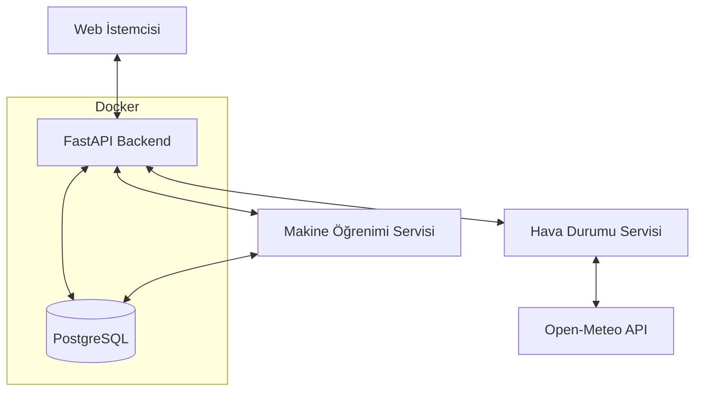
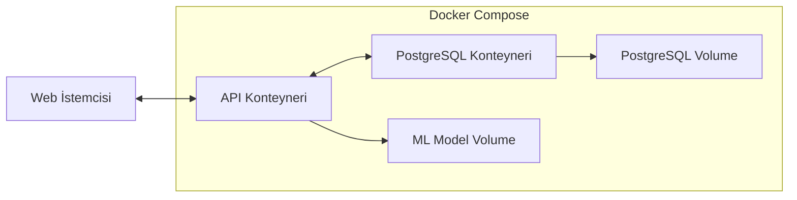

# Sistem Mimarisi ve Tasarım Desenleri

## Genel Mimari
Sistem, aşağıdaki ana bileşenlerden oluşmaktadır:



## Docker Mimarisi
Sistem, Docker ve Docker Compose kullanılarak containerize edilmiştir:



## Dosya Yapısı
Projenin dosya yapısı aşağıdaki şekilde organize edilmiştir:

```
Solar-Backend/
├── app/
│   ├── api/
│   │   ├── routes/
│   │   │   ├── __init__.py
│   │   │   ├── inverter_routes.py
│   │   │   ├── prediction_routes.py
│   │   │   ├── model_routes.py
│   │   │   ├── data_routes.py      # Yeni: CSV yükleme ve veri işleme rotaları
│   │   │   └── weather_routes.py   # Yeni: Hava durumu veri rotaları
│   │   └── __init__.py
│   ├── core/
│   │   ├── __init__.py
│   │   └── config.py
│   ├── db/
│   │   ├── __init__.py
│   │   └── database.py
│   ├── models/
│   │   ├── __init__.py
│   │   ├── inverter.py
│   │   └── weather.py        # Yeni: Hava durumu verileri için model
│   ├── schemas/
│   │   ├── __init__.py
│   │   ├── inverter.py
│   │   └── weather.py        # Yeni: Hava durumu şemaları
│   ├── services/
│   │   ├── __init__.py
│   │   ├── prediction_service.py
│   │   ├── model_training_service.py   # Yeni: Model eğitim servisi
│   │   ├── data_import_service.py      # Yeni: Veri içe aktarma servisi
│   │   └── weather_service.py          # Yeni: Hava durumu API servisi
│   ├── ml/
│   │   ├── __init__.py
│   │   ├── models/           # Eğitilmiş modellerin saklandığı klasör
│   │   ├── preprocessing.py  # Veri ön işleme
│   │   └── training.py       # Model eğitim kodları
│   └── __init__.py
├── requirements.txt
├── Dockerfile                # Docker imajı yapılandırması
├── docker-compose.yml        # Çok konteynerli Docker yapılandırması
├── .dockerignore             # Docker imajına dahil edilmeyecek dosyalar
├── main.py                   # Ana uygulama giriş noktası
└── memory-bank/
```

## Katmanlı Mimari
Proje, aşağıdaki katmanlardan oluşacaktır:

1. **API Katmanı**: FastAPI ile oluşturulmuş REST endpoint'leri (`app/api/routes/`)
2. **Servis Katmanı**: İş mantığı, veri işleme ve model etkileşimleri (`app/services/`)
3. **Model Katmanı**: Veritabanı modelleri ve şemaları (`app/models/` ve `app/schemas/`)
4. **Tahmin Katmanı**: Makine öğrenimi modelleri ve tahmin mekanizmaları (`app/ml/`)
5. **Veri Katmanı**: PostgreSQL veritabanı etkileşimleri (`app/db/`)
6. **Dış Servis Katmanı**: Dış API'lerle iletişim (Hava durumu API'si)
7. **Container Katmanı**: Docker ile uygulama ve veritabanının containerize edilmesi

## Veri Modelleri
Sistem aşağıdaki ana veri modellerini kullanmaktadır:

1. **Inverter**: Güneş inverterları için temel bilgiler
2. **InverterData**: İnverterlardan alınan ölçüm verileri
3. **InverterPrediction**: İnverter güç çıktıları için tahmin verileri
4. **Model**: Makine öğrenimi modellerinin meta verileri
5. **WeatherData**: Hava durumu ölçüm verileri (yeni)
6. **WeatherPrediction**: Gelecek hava durumu tahminleri (yeni)
7. **ModelMetrics**: Model eğitim metrikleri (yeni)

## Temel Teknik Kararlar
- **Asenkron API**: FastAPI'nin asenkron özelliklerinin kullanılması
- **ORM Kullanımı**: SQLAlchemy ile veritabanı etkileşimleri
- **Pydantic Modelleri**: Veri doğrulama ve serileştirme için Pydantic kullanımı
- **Model Versiyonlama**: Eğitilen makine öğrenimi modellerinin versiyonlanması
- **Bağımsız Tahmin Servisi**: Tahmin işlemlerinin ayrı bir servis üzerinden sağlanması
- **Dış API Entegrasyonu**: Open-meteo API ile hava durumu verilerinin çekilmesi
- **CSV İçe Aktarma**: Çoklu inverter verilerini CSV dosyasından içe aktarma
- **İki Aşamalı Model Eğitimi**: Metrik hesaplama ve final model eğitimi
- **Docker Containerization**: Uygulamanın ve veritabanının Docker üzerinde çalıştırılması
- **Volume Kullanımı**: Veritabanı ve model verilerinin kalıcılığının sağlanması
- **Environment Değişkenleri**: Yapılandırma ayarlarının Docker Compose üzerinden yönetilmesi

## Docker Containerization Yaklaşımı
- **Multi-Container Yapısı**: API ve PostgreSQL için ayrı konteynerler
- **Docker Compose Orkestrasyon**: Konteynerler arası iletişim ve yapılandırma yönetimi
- **Volume Yönetimi**: Veritabanı verilerinin kalıcılığı için volume kullanımı
- **Port Mapping**: API için 8000, PostgreSQL için 5432 portlarının dışa açılması
- **Environment Değişkenleri**: Duyarlı yapılandırma bilgilerinin Docker Compose üzerinden sağlanması
- **Health Check**: PostgreSQL konteynerinin hazır olduğundan emin olmak için health check kullanımı
- **Restart Policy**: Konteynerlerin çökmesi durumunda otomatik yeniden başlatılması

## API Endpoint Yapısı
API, aşağıdaki temel endpoint gruplarına sahiptir:

1. **Inverter Endpoint'leri** (`/api/v1/inverters/`):
   - İnverter kayıtlarının oluşturulması, listelenmesi ve yönetimi
   - Gerçek inverter çıktılarının sorgulanması

2. **Tahmin Endpoint'leri** (`/api/v1/predictions/`):
   - Tahmin verilerinin oluşturulması ve sorgulanması
   - İnverter bazlı tahmin istekleri
   - 8 inverterin güç çıktısı tahminlerini toplu alma

3. **Model Endpoint'leri** (`/api/v1/models/`):
   - Makine öğrenimi modellerinin yönetimi
   - Model eğitim istekleri ve metrik sonuçları

4. **Veri Endpoint'leri** (`/api/v1/data/`): (Yeni)
   - CSV dosyası yükleme
   - Veri içe aktarma işlemlerinin yönetilmesi

5. **Hava Durumu Endpoint'leri** (`/api/v1/weather/`): (Yeni)
   - Hava durumu verilerini çekme
   - Veritabanındaki hava durumu verilerini sorgulama

## Veri Akışı
1. **Veri Yükleme Akışı**:
   - CSV dosyası API'ye yüklenir
   - İnverter verileri veritabanına kaydedilir
   - Open-meteo API'den ilgili tarih aralığı için hava durumu verileri çekilir
   - Hava durumu verileri veritabanına kaydedilir
   - Model eğitimi tetiklenebilir

2. **Model Eğitim Akışı**:
   - Veritabanından inverter ve hava durumu verileri çekilir
   - İlk eğitim: Veri %70 eğitim, %30 test olarak bölünür
   - Model metrikleri (R², MAE, RMSE) hesaplanır
   - İkinci eğitim: Tüm veriyle modeller eğitilir
   - Modeller disk üzerinde saklanır, metaverileri veritabanına kaydedilir

3. **Tahmin Akışı**:
   - Open-meteo API'den gelecek hava durumu tahminleri çekilir
   - Modeller kullanılarak inverter güç çıktıları tahmin edilir
   - Tahmin sonuçları veritabanına kaydedilir

4. **API Sunumu Akışı**:
   - Gerçek inverter verileri veritabanından çekilir
   - Tahmin sonuçları veritabanından çekilir
   - İstemciye JSON formatında sunulur

## Bileşen İlişkileri
- **Controller -> Service**: API endpoint'leri ilgili servisleri çağırır
- **Service -> Repository**: Servisler veri erişimi için ORM modellerini kullanır
- **Service -> ML Model**: Servisler tahmin için ML modellerini kullanır
- **ML Model -> Repository**: Model eğitimi için veritabanından veri çekilir
- **Weather Service -> External API**: Hava durumu servisi dış API'yi çağırır

## Ölçeklenebilirlik Yaklaşımı
- Modeller birbirinden bağımsız olarak eğitilebilir ve güncellenebilir
- API, artan talep durumunda yatay olarak ölçeklenebilir
- Veritabanı performans optimizasyonları için indeksleme stratejileri kullanılacaktır
- Uzun süren model eğitimleri için asenkron işleme yöntemi kullanılacaktır
- Docker imajları ölçeklenebilir sistemlere (Kubernetes vb.) kolay entegre edilebilir
- Veritabanı yükü artarsa, PostgreSQL için ayrı bir sunucu kullanılabilir 